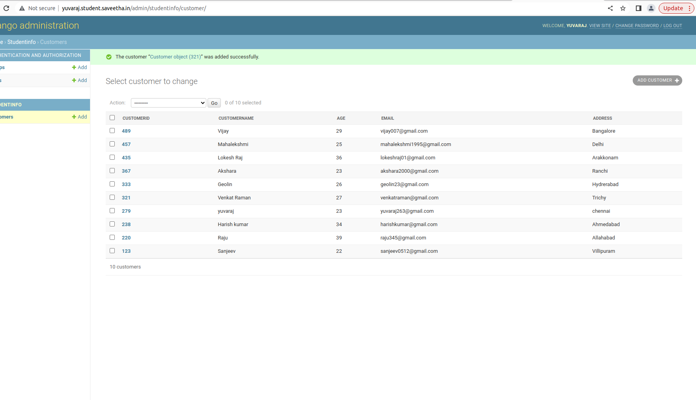

# Django ORM Web Application

## AIM
To develop a Django application to store and retrieve data from a database using Object Relational Mapping(ORM).

## Entity Relationship Diagram


## DESIGN STEPS

### STEP 1:
creating and collecting datas from customer using django

### STEP 2:
implementation using python code.

### STEP 3:

Pushing into github

## PROGRAM
```
from django.db import models
from django.contrib import admin
# Create your models here.

class Customer(models.Model):
      customerid = models.CharField(max_length=10,primary_key=True)
      customername = models.CharField(max_length=100)
      age = models.IntegerField()
      email = models.EmailField()
      address=models.CharField(max_length=100)

class CustomerAdmin(admin.ModelAdmin):
    list_display = ('customerid','customername','age','email','address')   
```

## OUTPUT




## RESULT
thus, the experiment was executed successfully..
